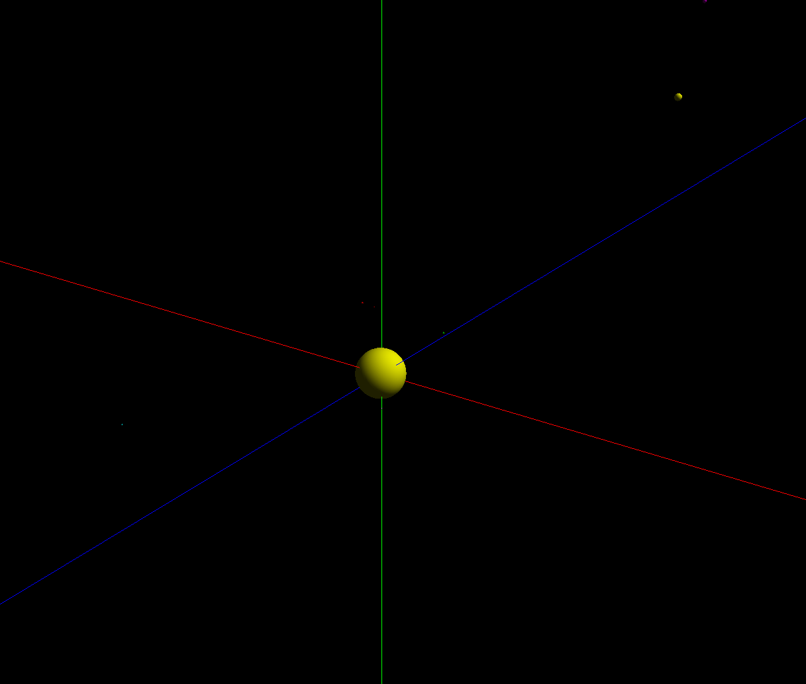

# OrbitalMotionCSX
Orbital Motion Project

## Graphics

### Solar System Simulations
- 
- 
- 

### Ellipse Simulations
- 
- 

### Area Calculation
- 

### Cube Law
- 

### Collision Game
- 
- Working collisions, many options at top of file for different simulations. Collisions are very rare, radius of planet is much smaller than displayed radius so the planets can be seen.

### Three D Graphics
- 
- Threed graphics using opengl and Pyopengl. Use QAWS to rotate around the sun and scroll wheel to zoom in and out